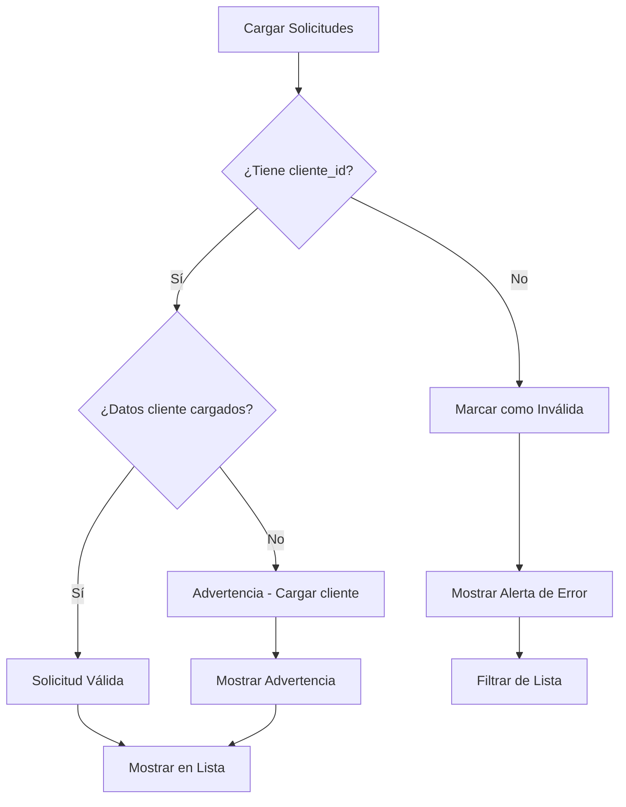

# Validaciones de Referencia Cliente

## 📋 Resumen de Implementación

Se han implementado validaciones completas para asegurar que cada documento y cada solicitud esté correctamente referenciada a un cliente.

## 🔧 Componentes Implementados

### 1. **Utilidades de Validación** (`src/utils/validation.ts`)
- `validarSolicitudConCliente()` - Verifica que solicitud tenga cliente válido
- `validarDocumentoConCliente()` - Verifica que documento tenga cliente válido
- `filtrarSolicitudesValidas()` - Filtra solicitudes con cliente válido
- `obtenerSolicitudesInvalidas()` - Obtiene solicitudes sin cliente válido
- `obtenerErroresValidacion()` - Genera mensajes de error de validación
- `obtenerNombreCliente()` - Obtiene nombre del cliente con validación
- `validarIntegridadSolicitud()` - Validación completa de solicitud

### 2. **Hook de Validación** (`src/hooks/useValidacionSolicitudes.ts`)
- Hook personalizado para validar solicitudes
- Retorna: `validationErrors`, `solicitudesValidas`, `solicitudesInvalidas`
- Gestión automática de errores y limpieza

### 3. **Componente de Alerta** (`src/components/shared/ValidationAlert.tsx`)
- Componente para mostrar alertas de validación
- Soporte para tipos: `warning` | `error`
- Botón de cierre opcional
- Lista de detalles de errores

### 4. **Servicio Validado** (`src/services/solicitud.service.ts`)
- Validación en `createSolicitud()` - Verifica cliente antes de crear
- Validación en `getSolicitudes()` - Filtra solicitudes con cliente válido
- Método `validarReferenciaCliente()` - Validación interna
- Método `validarExistenciaCliente()` - Verifica que cliente existe

### 5. **Componente Actualizado** (`src/components/solicitud/SolicitudList.tsx`)
- Usa `useValidacionSolicitudes` hook
- Muestra `ValidationAlert` cuando hay errores
- Filtra automáticamente solicitudes válidas
- Integra `SolicitudFilters` para manejo de filtros

## 🎯 Funcionalidades Implementadas

### ✅ **Validaciones Preventivas**
- Verificación de `cliente_id` antes de crear solicitud
- Validación de existencia del cliente en base de datos
- Filtrado automático de solicitudes sin cliente válido

### ✅ **Alertas Visuales**
- Alerta roja para solicitudes sin cliente
- Lista detallada de errores específicos
- Botón para cerrar alertas

### ✅ **Manejo de Errores**
- Logs en consola para debugging
- Mensajes de error descriptivos
- Manejo graceful de solicitudes inválidas

### ✅ **Integración Completa**
- Hook reutilizable para validación
- Componente de alertas reutilizable
- Servicios con validación integrada
- Componentes actualizados con validaciones

## 🚀 Uso en Código

### Hook de Validación
```typescript
const { validationErrors, solicitudesValidas, clearErrors } = useValidacionSolicitudes(solicitudes);
```

### Componente de Alerta
```typescript
<ValidationAlert
  type="error"
  message="Se encontraron solicitudes sin cliente válido"
  details={validationErrors}
  onClose={clearErrors}
/>
```

### Utilidades
```typescript
import { validarSolicitudConCliente, obtenerNombreCliente } from '../../utils/validation';

const esValida = validarSolicitudConCliente(solicitud);
const nombreCliente = obtenerNombreCliente(solicitud);
```

## 📊 Validaciones Implementadas

### **Solicitudes**
- ✅ `cliente_id` presente y válido
- ✅ Datos de `cliente` cargados
- ✅ Existencia del cliente en base de datos
- ✅ Productos asociados
- ✅ Estatus definido
- ✅ Fechas válidas

### **Documentos**
- ✅ `cliente_id` presente y válido
- ✅ Tipo de documento definido
- ✅ Archivo válido

### **Visualización**
- ✅ Nombres de cliente con fallback
- ✅ Indicadores visuales de error
- ✅ Filtrado automático de datos inválidos

## 🔍 Flujo de Validación



## 🎨 Características Visuales

### **Alertas de Error**
- Fondo rojo (`bg-red-50`)
- Borde rojo (`border-red-200`)
- Icono de error (`XCircleIcon`)
- Texto rojo (`text-red-800`)

### **Alertas de Advertencia**
- Fondo amarillo (`bg-yellow-50`)
- Borde amarillo (`border-yellow-200`)
- Icono de advertencia (`ExclamationTriangleIcon`)
- Texto amarillo (`text-yellow-800`)

### **Indicadores de Cliente**
- ⚠️ Cliente no encontrado
- ⚠️ Sin razón social
- ⚠️ Sin nombre

## 🔧 Configuración

### **Inclusión de Datos**
```typescript
// En servicios, siempre incluir datos del cliente
const response = await apiService.getPaginated<SolicitudCompleta>(
  this.endpoint,
  {
    ...filtros,
    include: 'cliente,productos,documentos'
  }
);
```

### **Validación Automática**
```typescript
// Hook se ejecuta automáticamente cuando cambian las solicitudes
useEffect(() => {
  validateSolicitudes();
}, [validateSolicitudes]);
```

## 📈 Beneficios

1. **Integridad de Datos**: Garantiza que todas las solicitudes tengan cliente válido
2. **Experiencia de Usuario**: Alertas claras cuando hay problemas de datos
3. **Debugging**: Logs detallados para identificar problemas
4. **Mantenibilidad**: Código reutilizable y bien estructurado
5. **Escalabilidad**: Fácil extensión a otros tipos de validación

## 🎯 Próximos Pasos

- [ ] Implementar validaciones similares para documentos
- [ ] Agregar validaciones de integridad para productos
- [ ] Crear dashboard de salud de datos
- [ ] Implementar validaciones en tiempo real
- [ ] Agregar tests unitarios para validaciones

---

**Estado**: ✅ **Completado**
**Última actualización**: Julio 2025
**Desarrollador**: GitHub Copilot
