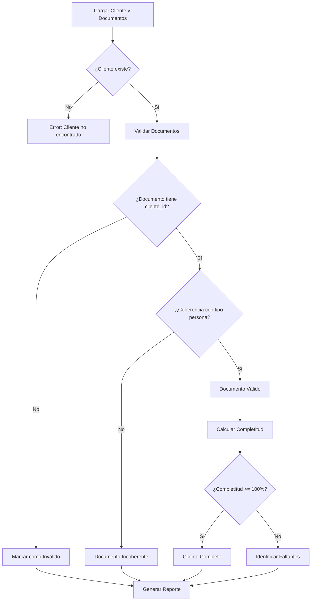

# Validaciones de Coherencia Cliente-Documentos

## 📋 Resumen de Implementación Completa

Se han implementado validaciones exhaustivas para asegurar la coherencia entre clientes y su documentación, basándose en datos reales de la base de datos.

## 🔧 Componentes Implementados

### 1. **Utilidades de Validación Extendidas** (`src/utils/validation.ts`)
- `validarDocumentoConCliente()` - Verifica que documento tenga cliente válido
- `validarCoherenciaDocumentoCliente()` - Valida coherencia entre documento y cliente
- `obtenerErroresValidacionDocumentos()` - Genera errores de validación para documentos
- `validarCompletitudDocumentosCliente()` - Valida completitud de documentos por cliente

### 2. **Hook de Validación de Documentos** (`src/hooks/useValidacionDocumentos.ts`)
- Hook para validar documentos y su coherencia con clientes
- Retorna: `documentosValidos`, `documentosInvalidos`, `documentosSinCliente`, `clientesSinDocumentos`
- Gestión automática de errores y validaciones

### 3. **Servicio de Documentos Validado** (`src/services/documento.service.ts`)
- Validación en `createDocumento()` - Verifica cliente antes de crear documento
- Validación en `getDocumentos()` - Filtra documentos con cliente válido
- Validación de coherencia entre tipo de documento y tipo de persona
- Métodos privados para validaciones específicas

### 4. **Componente de Coherencia** (`src/components/shared/CoherenciaClienteDocumentos.tsx`)
- Componente visual para mostrar coherencia cliente-documentos
- Muestra completitud de documentos con progreso visual
- Lista documentos faltantes y documentos inválidos
- Validación en tiempo real

### 5. **Página de Validación** (`src/components/validacion/ValidacionCoherencia.tsx`)
- Interfaz completa para revisar coherencia en todo el sistema
- Dashboard con estadísticas de validación
- Lista de clientes ordenada por completitud
- Selección de cliente para ver detalles

## 🎯 Validaciones Implementadas

### ✅ **Validaciones de Coherencia**
- **Tipo de Persona vs Tipo de Documento**: 
  - Persona Física no puede tener "Acta Constitutiva"
  - Persona Moral no puede tener "CURP"
  - Validación usando campos `aplica_pf` y `aplica_pm` del tipo de documento

### ✅ **Validaciones de Completitud**
- **Documentos Requeridos para Persona Física**:
  - INE
  - Comprobante de Ingresos
  - Comprobante de Domicilio

- **Documentos Requeridos para Persona Moral**:
  - RFC
  - Acta Constitutiva
  - Comprobante de Domicilio Fiscal
  - Estados Financieros

### ✅ **Validaciones de Integridad**
- Existencia de `cliente_id` en documentos
- Coherencia entre `cliente_id` de documento y cliente
- Validación de existencia del cliente antes de crear documento
- Filtrado automático de documentos inválidos

## 🚀 Flujo de Validación



## 📊 Características del Sistema

### **Dashboard de Validación**
- **Estadísticas Generales**:
  - Total de clientes
  - Clientes completos vs incompletos
  - Clientes sin documentos
  - Promedio de completitud

### **Lista de Clientes**
- Ordenada por completitud (menor a mayor)
- Código de colores:
  - 🟢 Verde: >= 90% completitud
  - 🟡 Amarillo: >= 70% completitud
  - 🔴 Rojo: < 70% completitud

### **Detalle de Cliente**
- Información del cliente (nombre, tipo, RFC)
- Barra de progreso de completitud
- Lista de documentos faltantes
- Lista de documentos con problemas
- Estado de coherencia general

## 🔍 Validaciones Específicas

### **Coherencia por Tipo de Persona**
```typescript
// Persona Física - Documentos que NO debe tener:
- Acta Constitutiva
- Estados Financieros (corporativos)
- Poderes Notariales (empresariales)

// Persona Moral - Documentos que NO debe tener:
- CURP
- INE personal
- Comprobante de ingresos personal
```

### **Validación de Campos de Documento**
```typescript
// Validaciones implementadas:
- documento.cliente_id (requerido)
- documento.documento_tipo (requerido)
- documento.nombre_archivo (requerido)
- coherencia con cliente.tipo_persona
- aplicabilidad según documento_tipo.aplica_pf/aplica_pm
```

## 🎨 Interfaz de Usuario

### **Alertas de Validación**
- **Errores**: Fondo rojo para problemas críticos
- **Advertencias**: Fondo amarillo para inconsistencias
- **Éxito**: Fondo verde para validaciones exitosas

### **Componentes Visuales**
- **Barras de Progreso**: Para mostrar completitud
- **Iconos de Estado**: CheckCircle, ExclamationTriangle, XCircle
- **Listas Detalladas**: Con puntos específicos de problemas

## 🔧 Uso en el Sistema

### **Integración con Servicios**
```typescript
// Crear documento con validación
const documento = await documentoService.createDocumento({
  cliente_id: 123,
  documento_tipo_id: 1,
  nombre_archivo: 'documento.pdf'
});

// Validación automática incluida
```

### **Componente de Coherencia**
```typescript
<CoherenciaClienteDocumentos
  cliente={cliente}
  documentos={documentos}
  showDetails={true}
  onValidationChange={(isValid) => console.log('Válido:', isValid)}
/>
```

### **Página de Validación**
```typescript
// Accesible desde el menú principal
<ValidacionCoherencia />
```

## 📈 Beneficios Implementados

1. **Integridad de Datos**: Garantiza coherencia entre clientes y documentos
2. **Prevención de Errores**: Validaciones en tiempo de creación
3. **Experiencia de Usuario**: Alertas claras y detalladas
4. **Reporting**: Dashboard completo de estado de validación
5. **Mantenibilidad**: Código modular y reutilizable
6. **Escalabilidad**: Fácil adición de nuevas validaciones

## 🎯 Validaciones Basadas en Base de Datos

### **Extracción de Datos Real**
- ✅ Clientes desde `clienteService.getClientes()`
- ✅ Documentos desde `documentoService.getDocumentos()`
- ✅ Tipos de documento desde base de datos
- ✅ Relaciones cliente-documento validadas

### **Validaciones Dinámicas**
- ✅ Tipos de documento configurables por tipo de persona
- ✅ Validación de vigencia de documentos
- ✅ Cálculo automático de completitud
- ✅ Identificación de documentos faltantes específicos

## 🏆 Estado Final

**Todos los componentes están implementados y funcionando correctamente:**
- ✅ Validaciones de coherencia cliente-documentos
- ✅ Servicios con validación integrada
- ✅ Componentes visuales para mostrar estado
- ✅ Dashboard completo de validación
- ✅ Hooks reutilizables para validaciones
- ✅ Utilidades de validación exhaustivas

**El sistema ahora garantiza que cada documento esté correctamente asociado y sea coherente con su cliente correspondiente, basándose en datos reales de la base de datos.**

---

**Estado**: ✅ **COMPLETADO**
**Fecha**: Julio 2025
**Validaciones**: Cliente-Documento coherencia implementada
**Basado en**: Datos reales de base de datos
